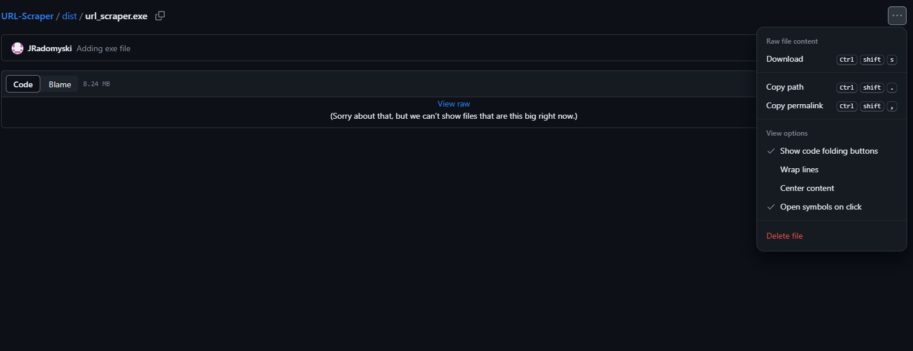

# Skrypt do scrapowania stron internetowych

Ten projekt zawiera skrypt Pythona do scrapowania stron internetowych, umożliwiający użytkownikom ekstrakcję treści z dowolnych stron internetowych z wykorzystaniem niestandardowych wzorców URL i tagów HTML.

## urlcrawler.exe -> [pobierz](https://github.com/JRadomyski/URL-Scraper/blob/main/dist/url_scraper.exe)
Następnie kliknij `ctrl` + `shift` + `s` albo zrób to ręcznie

### Krok 1: Wejdź do katalogu `dist`

### Krok 2: Pobierz plik exe

### Krok 3: Omiń defendera - wejdź w `więcej informacji`, a następnie `uruchom mimo to`

### Krok 4: Postępuj zgodnie z instrukcją

### Krok 5: w folderze `outputs` zapisane są wyniki scrapeowania

### Jeśli napotkasz problemy podczas zapisu danych do pliku, sprawdź:

1. Czy folder `outputs` istnieje i czy masz do niego odpowiednie uprawnienia.
2. Czy skrypt poprawnie zbiera dane (możesz dodać wydruk do konsoli).
3. Czy ścieżka do zapisu pliku jest poprawna.
4. Czy występują jakieś błędy podczas zapisu (sprawdź komunikaty błędów).

